# term-ai Architecture Documentation

## Table of Contents
1. [Overview](#overview)
2. [High-Level Architecture](#high-level-architecture)
3. [Core Components](#core-components)
4. [Data Flow](#data-flow)
5. [Mode Comparison](#mode-comparison)
6. [Search Provider System](#search-provider-system)
7. [Tool Calling Mechanism](#tool-calling-mechanism)
8. [Verbose Mode Processing](#verbose-mode-processing)
9. [Configuration System](#configuration-system)
10. [Error Handling](#error-handling)
11. [Design Decisions](#design-decisions)

---

## Overview

**term-ai** is a single-file Rust CLI application (~750 lines) that transforms natural language queries into shell commands using a local Ollama AI server. It supports two operational modes:

- **Legacy Mode**: Direct prompt → command generation
- **Websearch Mode**: Multi-turn tool calling with web search capabilities

### Key Characteristics

- **Single-file architecture**: All logic in `src/main.rs`
- **Synchronous HTTP**: Uses `reqwest::blocking` for simplicity
- **Zero runtime dependencies**: Connects to local Ollama instance
- **Aggressive optimization**: Release builds use LTO and high optimization levels
- **Backward compatible**: Legacy mode requires no configuration changes

---

## High-Level Architecture

```mermaid
graph TB
    User[User Input] --> CLI[CLI Parser<br/>Clap]
    CLI --> Prompt[Prompt Acquisition]
    Prompt --> Decision{Websearch<br/>Enabled?}

    Decision -->|No| Legacy[Legacy Mode<br/>build_prompt]
    Decision -->|Yes| Search[Websearch Mode<br/>chat_with_tools]

    Legacy --> Generate[/api/generate<br/>Endpoint]
    Search --> Chat[/api/chat<br/>Endpoint]

    Generate --> Response[Response]
    Chat --> ToolLoop{Tool Calls?}

    ToolLoop -->|Yes| Execute[Execute Tool]
    Execute --> Provider[Search Provider]
    Provider --> ToolLoop

    ToolLoop -->|No| VerboseCheck{Verbose?}
    VerboseCheck -->|Yes| Format[Format Output<br/>with Metadata]
    VerboseCheck -->|No| Response
    Format --> Response

    Response --> Output[stdout]

    style Legacy fill:#e1f5e1
    style Search fill:#e1e5f5
    style Provider fill:#f5e1e1
```

### Architecture Layers

| Layer | Responsibility | Components |
|-------|---------------|------------|
| **CLI** | Argument parsing, validation | `Args` struct, Clap |
| **Input** | Prompt acquisition | `get_user_prompt()` |
| **Routing** | Mode selection | `main()` decision logic |
| **Generation** | Command generation | `call_ollama()`, `chat_with_tools()` |
| **Tools** | Web search execution | Search providers, `execute_tool()` |
| **Output** | Formatting, display | Verbose formatting, stdout |

---

## Core Components

### Component Diagram

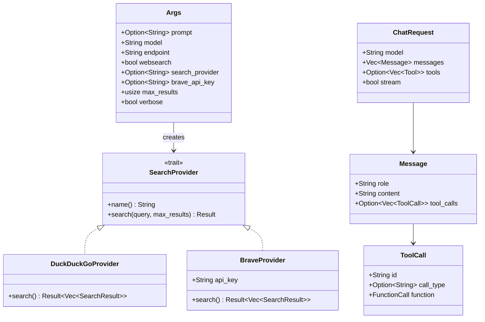

### Key Structures

#### 1. CLI Arguments (`Args`)
```rust
struct Args {
    prompt: Option<String>,      // CLI arg or None (uses stdin)
    model: String,                // Default: llama3.2, env: TERM_AI_MODEL
    endpoint: String,             // Default: http://localhost:11434
    websearch: bool,              // -w, --ws, --websearch
    search_provider: Option<String>, // Auto-detects if None
    brave_api_key: Option<String>,   // env: BRAVE_API_KEY
    max_results: usize,           // Default: 5
    verbose: bool,                // -v, --verbose
}
```

#### 2. Search Provider Trait
```rust
trait SearchProvider {
    fn name(&self) -> &str;
    fn search(&self, query: &str, max_results: usize)
        -> Result<Vec<SearchResult>>;
}
```

**Implementations:**
- **DuckDuckGoProvider**: HTML scraping (free, bot detection issues)
- **BraveProvider**: JSON API (requires API key, reliable)

#### 3. Chat API Structures
```rust
struct Message {
    role: String,              // "system", "user", "assistant", "tool"
    content: String,
    tool_calls: Option<Vec<ToolCall>>,
}

struct ChatRequest {
    model: String,
    messages: Vec<Message>,
    tools: Option<Vec<Tool>>,  // Function definitions
    stream: bool,              // Always false
}
```

---

## Data Flow

### Legacy Mode Flow

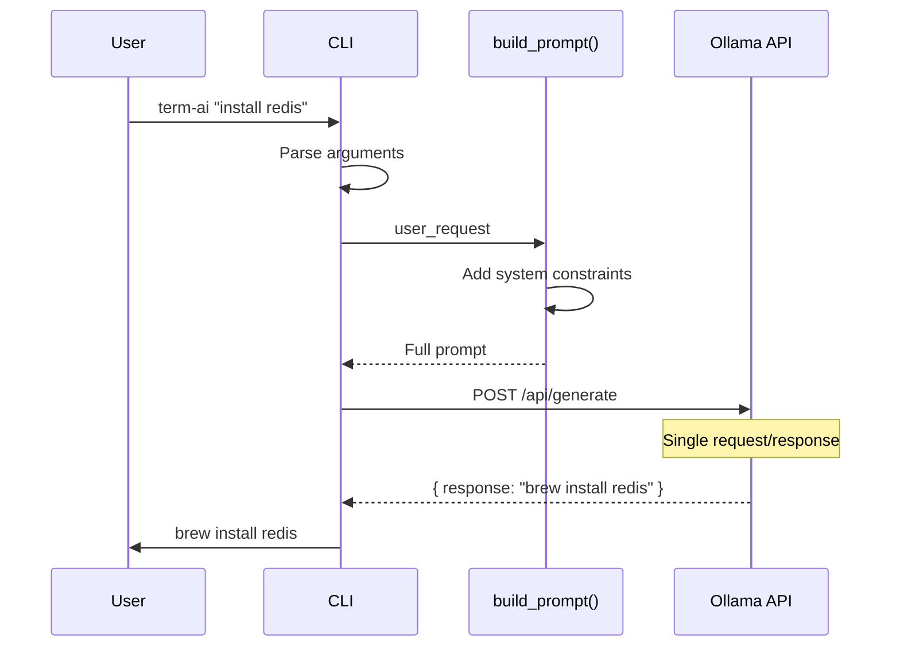

**Steps:**
1. User provides natural language query
2. CLI parses arguments
3. `build_prompt()` wraps query with system instructions
4. Single HTTP POST to `/api/generate`
5. Response printed to stdout

**Characteristics:**
- ✅ Fast (single API call)
- ✅ Simple (no state management)
- ✅ Works with any Ollama model
- ❌ No access to current information

---

### Websearch Mode Flow

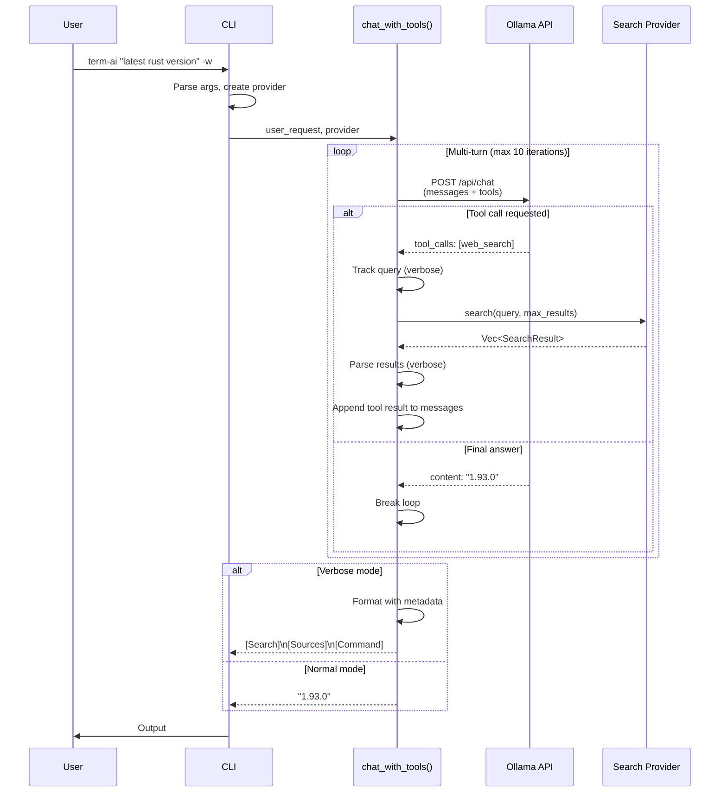

**Steps:**
1. User provides query with `-w` flag
2. CLI creates search provider
3. `chat_with_tools()` initiates multi-turn loop
4. **Iteration 1**: Model may request tool calls
5. Tool execution: Search provider fetches results
6. **Iteration 2**: Model processes results, returns answer
7. Verbose formatting (if enabled)
8. Output to stdout

**Characteristics:**
- ✅ Access to current information
- ✅ Model decides when to search
- ✅ Multiple tool calls possible
- ⚠️ Requires tool-compatible model
- ⚠️ Slower (multiple API calls)

---

## Mode Comparison

### Feature Matrix

| Feature | Legacy Mode | Websearch Mode |
|---------|-------------|----------------|
| **Endpoint** | `/api/generate` | `/api/chat` |
| **API Calls** | 1 | 2-10 (avg: 2-3) |
| **Model Requirements** | Any Ollama model | Tool calling support |
| **Latency** | ~1-2s | ~3-6s |
| **Current Info** | ❌ Training data only | ✅ Web search |
| **Complexity** | Low | Medium |
| **Verbose Support** | ❌ | ✅ |
| **Use Case** | Static commands | Version queries, latest info |

### Decision Tree

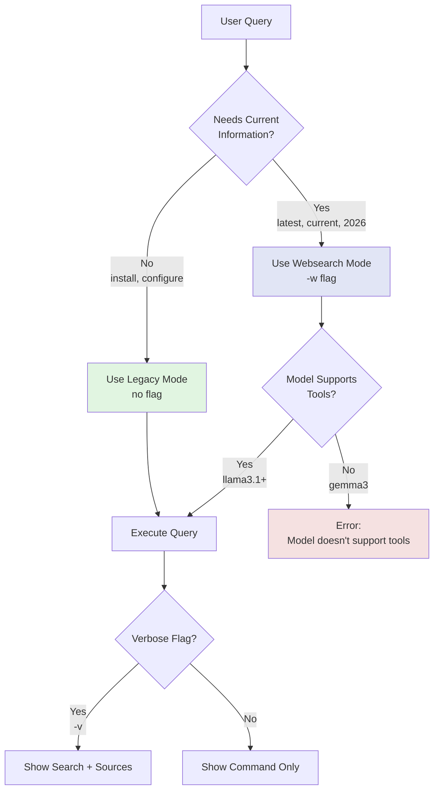

---

## Search Provider System

### Provider Selection Logic

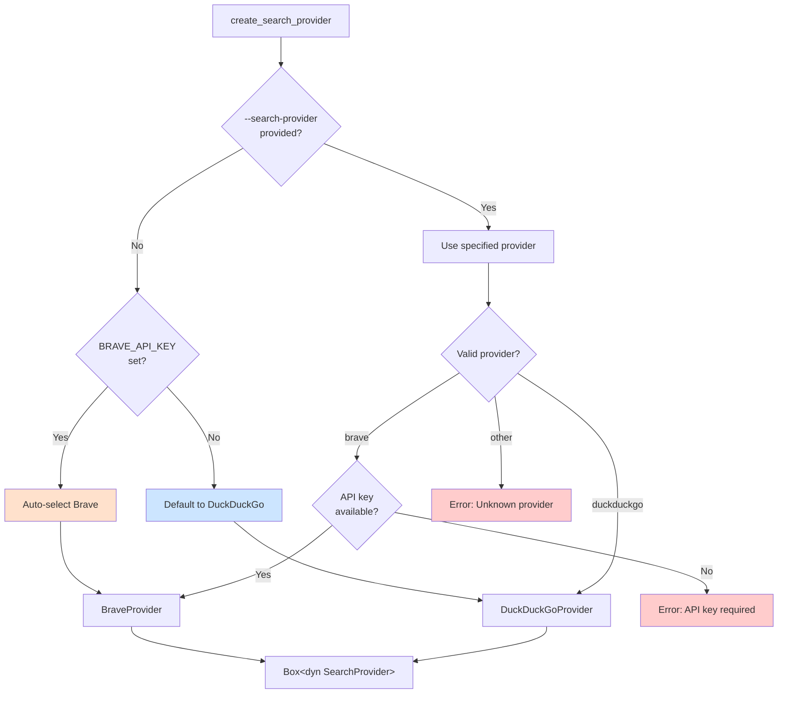

### DuckDuckGo Implementation

**Method**: HTML Scraping

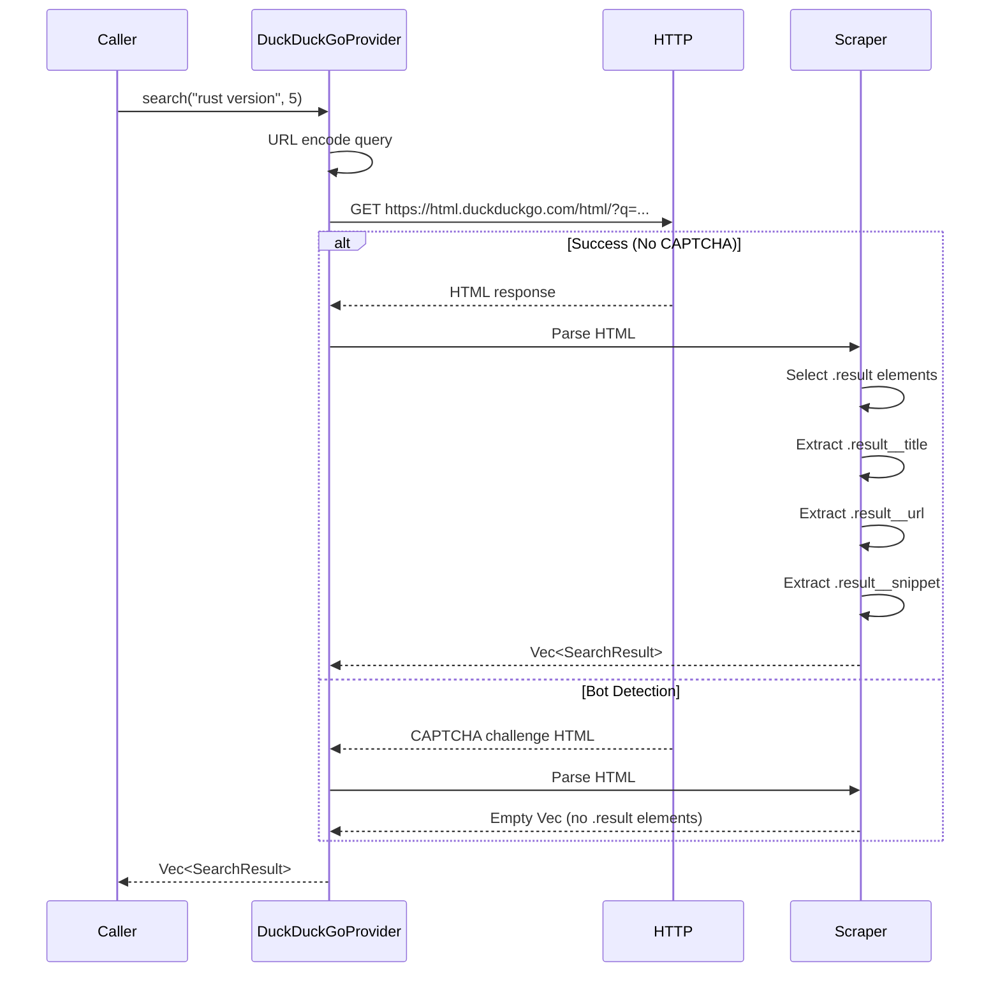

**CSS Selectors:**
```css
.result               /* Result container */
.result__title        /* Title text */
.result__url          /* URL text */
.result__snippet      /* Description snippet */
```

**Limitations:**
- Bot detection (CAPTCHA challenges)
- HTML structure changes break scraping
- No guarantee of results

### Brave Implementation

**Method**: JSON API

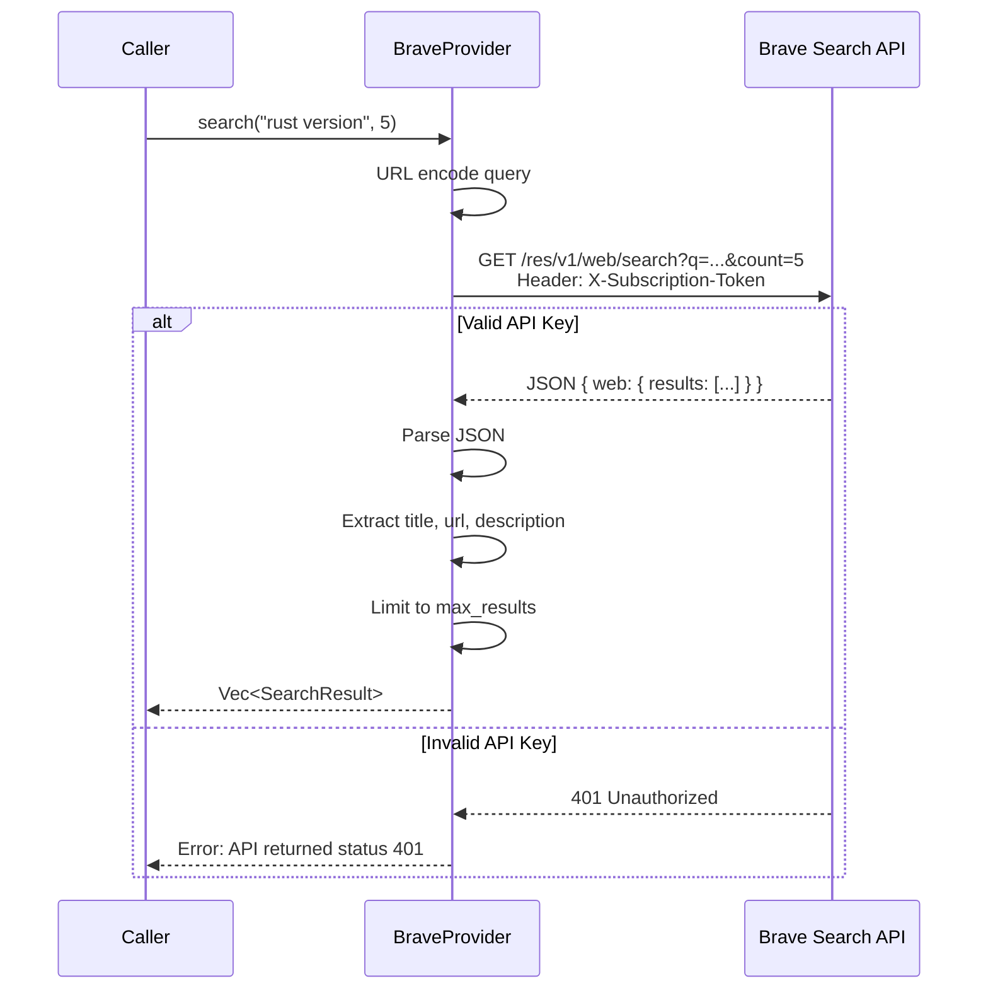

**Advantages:**
- ✅ Stable API contract
- ✅ No bot detection
- ✅ Reliable results
- ✅ Proper JSON structure

**Requirements:**
- API key from [Brave Search API](https://brave.com/search/api/)
- Rate limits based on plan

---

## Tool Calling Mechanism

### Tool Definition

The `web_search` tool is defined in `build_tool_definitions()`:

```json
{
  "type": "function",
  "function": {
    "name": "web_search",
    "description": "Search the web for current information...",
    "parameters": {
      "type": "object",
      "properties": {
        "query": {
          "type": "string",
          "description": "The search query to execute"
        }
      },
      "required": ["query"]
    }
  }
}
```

### Multi-Turn Loop

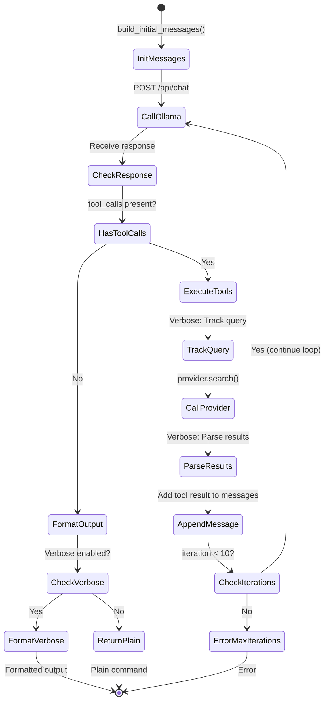

### Tool Execution Flow

```mermaid
sequenceDiagram
    participant Loop as chat_with_tools()
    participant Executor as execute_tool()
    participant Provider as SearchProvider

    Loop->>Loop: Receive tool_calls from model

    loop For each tool_call
        Loop->>Loop: Extract query from arguments
        Loop->>Loop: Track query (if verbose)

        Loop->>Executor: execute_tool(tool_call, provider)
        Executor->>Executor: Match function name

        alt web_search
            Executor->>Executor: Extract query parameter
            Executor->>Provider: search(query, max_results)
            Provider-->>Executor: Vec<SearchResult>
            Executor->>Executor: JSON serialize results
            Executor-->>Loop: JSON string
        else Unknown tool
            Executor-->>Loop: Error: Unknown tool
        end

        alt Verbose mode
            Loop->>Loop: Parse JSON results
            Loop->>Loop: Extract top 3 for summary
            Loop->>Loop: Format: "1. Title - Snippet..."
            Loop->>Loop: Store in search_results_summary
        end

        Loop->>Loop: Create tool result message
        Loop->>Loop: Append to messages array
    end

    Loop->>Loop: Continue to next iteration
```

---

## Verbose Mode Processing

### Architecture

Verbose mode uses **post-processing** rather than prompt engineering to avoid confusing the model:

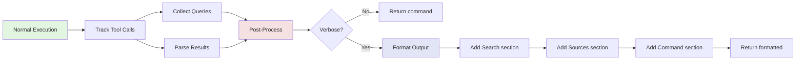

### Data Collection

**During execution** (in `chat_with_tools()`):

```rust
// Tracking variables
let mut search_queries: Vec<String> = Vec::new();
let mut search_results_summary: Vec<String> = Vec::new();

// When tool call detected
if tool_call.function.name == "web_search" {
    // 1. Track the query
    search_queries.push(query.to_string());

    // 2. Execute search
    let results = provider.search(query, max_results)?;

    // 3. Parse and summarize (if verbose)
    if verbose {
        for (i, res) in results.iter().take(3).enumerate() {
            search_results_summary.push(format!(
                "{}. {} - {}",
                i + 1,
                res.title,
                truncate(res.snippet, 100)
            ));
        }
    }
}
```

### Output Formatting

**After execution** (final response received):

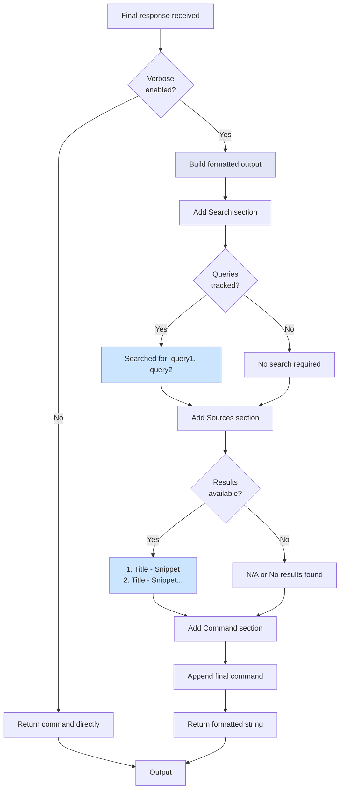

### Output Format

```
[Search]
Searched for: install latest redis on macOS

[Sources]
1. Redis Installation Guide - Redis is available via Homebrew on macOS. Use 'brew install redis'...
2. Homebrew Redis Formula - Official formula for Redis database server, includes configuration...
3. Redis macOS Setup - Step-by-step guide for installing and configuring Redis on macOS systems...

[Command]
brew install redis
```

**Empty search:**
```
[Search]
No search required

[Sources]
N/A

[Command]
brew install docker
```

---

## Configuration System

### Priority Hierarchy

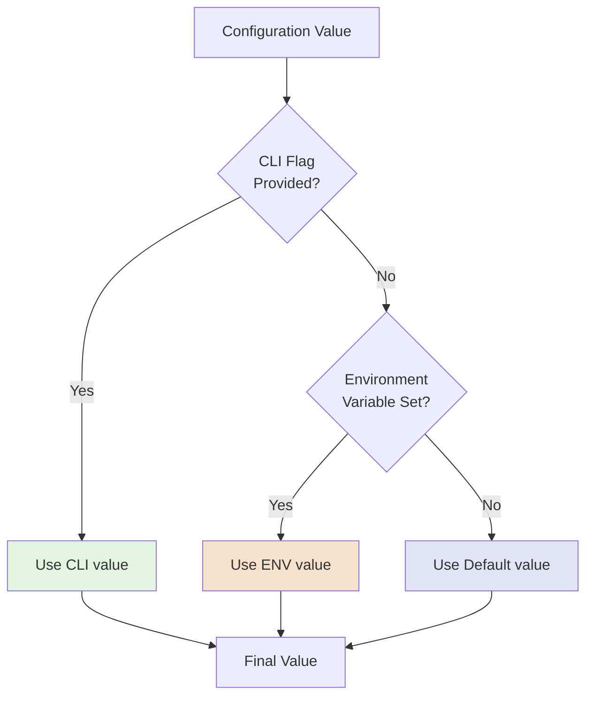

### Configuration Matrix

| Parameter | CLI Flag | Environment Variable | Default | Validation |
|-----------|----------|---------------------|---------|------------|
| **Prompt** | `[PROMPT]` | - | stdin | Required (CLI or stdin) |
| **Model** | `--model` | `TERM_AI_MODEL` | `llama3.2` | None |
| **Endpoint** | `--endpoint` | - | `http://localhost:11434` | None |
| **Websearch** | `-w`, `--ws`, `--websearch` | - | `false` | Boolean |
| **Search Provider** | `--search-provider` | Auto-detect via `BRAVE_API_KEY` | `duckduckgo` | Enum: duckduckgo, brave |
| **Brave API Key** | `--brave-api-key` | `BRAVE_API_KEY` | `None` | Required for Brave |
| **Max Results** | `--max-results` | - | `5` | Positive integer |
| **Verbose** | `-v`, `--verbose` | - | `false` | Boolean |

### Examples

**All defaults:**
```bash
term-ai "install redis"
# model: llama3.2 (default)
# endpoint: http://localhost:11434 (default)
# websearch: false (default)
```

**Environment variables:**
```bash
export TERM_AI_MODEL=llama3.1
export BRAVE_API_KEY=xxx

term-ai "latest rust version" -w
# model: llama3.1 (from env)
# provider: brave (auto-detected from env)
# websearch: true (from flag)
```

**CLI overrides:**
```bash
export TERM_AI_MODEL=gemma3
export BRAVE_API_KEY=xxx

term-ai "query" -w --model llama3.1 --search-provider duckduckgo
# model: llama3.1 (CLI overrides env)
# provider: duckduckgo (CLI overrides auto-detect)
```

---

## Error Handling

### Error Flow

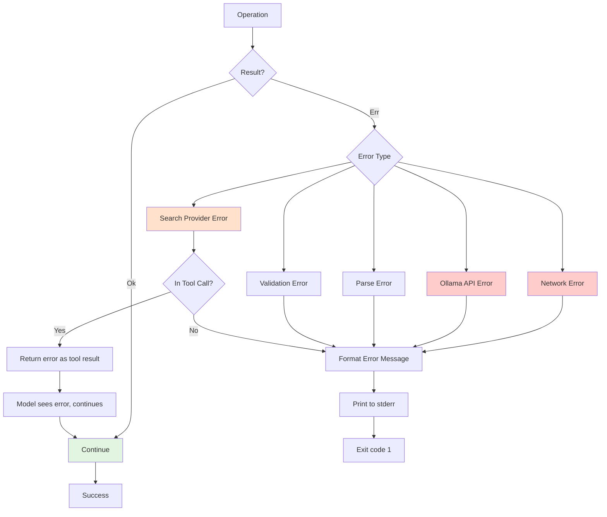

### Error Categories

#### 1. Input Errors
**Validation failures before API calls**

| Error | Cause | Message | Exit Code |
|-------|-------|---------|-----------|
| No prompt | No CLI arg or stdin | "No prompt provided via argument or stdin" | 1 |
| Invalid provider | Unknown search provider | "Unknown search provider: 'xxx'. Valid options: duckduckgo, brave" | 1 |
| Missing API key | Brave selected without key | "Brave search provider requires an API key..." | 1 |

#### 2. Network Errors
**Connection and HTTP failures**

```rust
// Timeout configuration
Client::builder()
    .timeout(Duration::from_secs(30))  // /api/chat
    .timeout(Duration::from_secs(10))  // Search providers
```

| Error | Cause | Handling |
|-------|-------|----------|
| Connection refused | Ollama not running | "Error: Connection refused" → Exit 1 |
| Timeout | Slow response | "Error: request timed out" → Exit 1 |
| DNS failure | Network issue | Network error message → Exit 1 |

#### 3. Ollama API Errors
**API-level failures**

| Status | Error | Message | Handling |
|--------|-------|---------|----------|
| 404 | Model not found | "Ollama returned status: 404 Not Found" | Exit 1 |
| 400 | Bad request | "Ollama returned status {}: {error_text}" | Exit 1 |
| 500 | Server error | "Ollama returned status {}: {error_text}" | Exit 1 |
| Tool unsupported | Model doesn't support tools | "model does not support tools" | Exit 1 with clear message |

#### 4. Search Provider Errors
**Search-specific failures**

**In tool execution context:**
```rust
let tool_result = match execute_tool(tool_call, provider, max_results) {
    Ok(result) => result,
    Err(e) => format!("Error executing tool: {}", e),  // Model sees error
};
```

**Error passed to model as tool result**, model continues execution:
- DuckDuckGo CAPTCHA → Empty results
- Brave API rate limit → Error message to model
- Network timeout → Error message to model

#### 5. Loop Protection
**Infinite loop prevention**

```rust
const MAX_ITERATIONS: usize = 10;

for iteration in 0..MAX_ITERATIONS {
    // ... tool calling logic
}

// If we exit loop without returning:
Err(format!(
    "Maximum iterations ({}) exceeded. The model may be stuck in a tool-calling loop.",
    MAX_ITERATIONS
))
```

**Triggers when:**
- Model requests tools in every iteration
- Never provides final answer
- Tool calls don't satisfy model

---

## Design Decisions

### 1. Single-File Architecture

**Decision**: Keep all logic in `src/main.rs` (~750 lines)

```
src/main.rs
├── CLI structures (Args)
├── Data structures (Message, ChatRequest, etc.)
├── Search provider trait + implementations
├── Core functions
│   ├── build_prompt()
│   ├── call_ollama()
│   ├── chat_with_tools()
│   └── execute_tool()
├── Helper functions
│   ├── get_user_prompt()
│   ├── create_search_provider()
│   └── build_tool_definitions()
├── main()
└── tests module
```

**Rationale:**
- ✅ Easy to understand (single entry point)
- ✅ No module complexity
- ✅ Fast compilation
- ✅ Easy to audit
- ⚠️ Limit: Keep under 1000 lines

**Alternative considered**: Modular structure
```
src/
├── main.rs
├── cli/
├── providers/
├── ollama/
└── tools/
```
❌ Rejected: Overhead not justified for <1000 lines

---

### 2. Synchronous HTTP (Blocking)

**Decision**: Use `reqwest::blocking` instead of async

```rust
use reqwest::blocking::Client;  // Not reqwest::Client

let response = client.post(&url).json(&body).send()?;  // Blocks
```

**Rationale:**
- ✅ Simpler code (no async/await)
- ✅ Sequential tool calling (inherently synchronous)
- ✅ No runtime overhead (no tokio executor needed)
- ✅ Easier error handling
- ⏱️ Performance: Not a bottleneck (waiting on Ollama anyway)

**Alternative considered**: Async with tokio
```rust
#[tokio::main]
async fn main() {
    let response = client.post(&url).json(&body).send().await?;
}
```
❌ Rejected: No concurrency benefits for sequential CLI tool

---

### 3. Trait-Based Search Providers

**Decision**: Abstract search behind trait interface

```rust
trait SearchProvider {
    fn name(&self) -> &str;
    fn search(&self, query: &str, max_results: usize)
        -> Result<Vec<SearchResult>>;
}

// Allows runtime polymorphism
let provider: Box<dyn SearchProvider> = create_search_provider(&args)?;
provider.search("query", 5)?;  // Dynamic dispatch
```

**Rationale:**
- ✅ Easy to add new providers (Google, Bing, etc.)
- ✅ Testable (can mock providers)
- ✅ Auto-detection logic decoupled
- ✅ Configuration flexibility

**Alternative considered**: Enum dispatch
```rust
enum Provider {
    DuckDuckGo,
    Brave(String),  // API key
}

impl Provider {
    fn search(&self, query: &str) -> Result<Vec<SearchResult>> {
        match self {
            Provider::DuckDuckGo => { /* ... */ }
            Provider::Brave(key) => { /* ... */ }
        }
    }
}
```
❌ Rejected: Less extensible, harder to test

---

### 4. Verbose Post-Processing (Not Prompt Engineering)

**Decision**: Format verbose output after execution, not via prompt

**Approach:**
```rust
// ❌ NOT THIS (prompt engineering):
let prompt = if verbose {
    "Respond with [Search] [Sources] [Command] format..."
} else {
    "Respond with command only..."
};

// ✅ THIS (post-processing):
let response = chat_with_tools(...);  // Same prompt always

if verbose {
    format!("[Search]\n{}\n[Sources]\n{}\n[Command]\n{}",
        tracked_queries, tracked_sources, response)
} else {
    response
}
```

**Rationale:**
- ✅ Doesn't confuse model
- ✅ Consistent model behavior
- ✅ No extra API calls
- ✅ Full control over format
- ✅ Easier to maintain

**Alternative considered**: Prompt engineering
❌ Rejected: Model might mix formats, include formatting in command output, or require extra instructions

---

### 5. No Confidence Scores

**Decision**: Don't implement confidence scoring

**Reasons:**

| Factor | Issue |
|--------|-------|
| **Technical** | Ollama doesn't provide confidence scores in API |
| **Implementation** | Would require 2nd API call (2x latency) |
| **Accuracy** | Tool calling is binary (yes/no), not probabilistic |
| **Security** | False confidence ("95% sure rm -rf is safe") |
| **Philosophy** | Shell commands need human verification regardless |

**Better alternatives implemented:**
- ✅ Verbose mode (transparency)
- ✅ Deterministic safety constraints
- ✅ Show sources (user can judge quality)

---

### 6. Tool Calling vs Always-On Search

**Decision**: Make websearch opt-in via `--websearch` flag

**Rationale:**

| Approach | Pros | Cons | Decision |
|----------|------|------|----------|
| **Always-on** | Convenient, always current | Slower for simple queries, unnecessary API calls | ❌ |
| **Opt-in** | Fast legacy mode available, user control | Extra flag needed | ✅ |
| **Auto-detect** | Smart, no flags | Hard to predict behavior, can't override | ❌ |

**Usage pattern:**
```bash
# Fast (no search needed)
term-ai "install docker"  # ~1-2s

# Current info (search needed)
term-ai "latest docker version" -w  # ~3-6s
```

---

### 7. Max 10 Iterations

**Decision**: Hard limit on tool-calling loop

```rust
const MAX_ITERATIONS: usize = 10;

for iteration in 0..MAX_ITERATIONS {
    // ...tool calling logic
}

// If loop completes without returning:
Err("Maximum iterations exceeded...")
```

**Rationale:**
- ✅ Prevents infinite loops
- ✅ Protects against model bugs
- ✅ Bounds worst-case latency (10 * 3s = 30s max)
- ✅ Provides clear error message

**Typical iteration counts:**
- Simple query: 1-2 iterations
- With search: 2-3 iterations
- Complex multi-search: 3-5 iterations
- 10 = safety margin

---

## Performance Characteristics

### Latency Breakdown

**Legacy Mode:**
```
Total: ~1-2 seconds
├── CLI parsing: <1ms
├── Prompt building: <1ms
├── Network (POST): ~50-100ms
├── Ollama generation: ~1-2s
└── Output: <1ms
```

**Websearch Mode (typical):**
```
Total: ~3-6 seconds
├── CLI parsing: <1ms
├── Provider creation: <1ms
├── Iteration 1:
│   ├── POST /api/chat: ~50ms
│   ├── Model decides to search: ~1-2s
│   └── Response with tool_call: ~50ms
├── Tool execution:
│   ├── Search provider HTTP: ~500ms-2s
│   └── Parse results: ~10ms
├── Iteration 2:
│   ├── POST /api/chat: ~50ms
│   ├── Model processes results: ~1-2s
│   └── Final response: ~50ms
└── Verbose formatting: <10ms
```

### Memory Usage

**Steady-state:**
- Binary size: ~8-12 MB (release, stripped)
- Runtime memory: ~10-20 MB
- Message history: ~1-5 KB per message
- Search results: ~5-10 KB per query

**Growth factors:**
- Each tool call adds 2 messages (assistant + tool)
- 10 iterations max = ~20 messages = ~50-100 KB
- Negligible for CLI tool

---

## Testing Strategy

### Test Coverage

```
13 unit tests total

CLI & Configuration:
├── test_build_prompt_includes_system_instructions
├── test_build_prompt_user_request_interpolation
└── test_build_prompt_consistency

Chat API:
├── test_build_initial_messages
├── test_build_initial_messages_verbose
└── test_build_tool_definitions

Search Providers:
├── test_provider_factory_duckduckgo
├── test_provider_factory_auto_duckduckgo
├── test_provider_factory_auto_brave
├── test_provider_factory_brave_with_key
├── test_provider_factory_brave_without_key
└── test_provider_factory_invalid_provider

Serialization:
└── test_search_result_serialization
```

### Test Philosophy

**Unit tests cover:**
- ✅ Configuration logic
- ✅ Prompt construction
- ✅ Provider factory (auto-detection)
- ✅ Data structure serialization

**Not tested (manual/integration):**
- ❌ Actual HTTP calls (requires running Ollama)
- ❌ Search provider scraping (external dependency)
- ❌ End-to-end flows (requires network)

**Rationale**: CLI tool with external dependencies, full integration tests not feasible in CI

---

## Security Considerations

### 1. System Prompt Safety Constraints

**Hardcoded constraints (cannot be bypassed):**

```rust
fn build_prompt(user_request: &str) -> String {
    format!("
        You are an expert macOS terminal engineer.

        Constraints:
        - Respond ONLY with valid shell commands
        - Avoid destructive operations (no rm -rf, no disk formatting)
        - No sudo unless clearly necessary and safe
        - Prefer Homebrew for package management

        User request:
        {}
    ", user_request)
}
```

**Protection:**
- User input cannot modify system constraints
- String interpolation places user input after instructions
- No prompt injection vulnerabilities

### 2. Command Execution

**Important**: term-ai **does not execute commands**

```rust
// Output goes to stdout only
println!("{}", response);

// User manually reviews and executes:
// $ term-ai "install docker"
// brew install --cask docker
// $ brew install --cask docker  # User types this
```

**Benefits:**
- ✅ User reviews every command
- ✅ No automatic execution risk
- ✅ No privilege escalation
- ✅ User maintains control

### 3. API Key Handling

**Brave API key:**
```rust
#[arg(long, env = "BRAVE_API_KEY")]
brave_api_key: Option<String>,
```

**Security measures:**
- ✅ Never logged or printed
- ✅ Only transmitted to Brave API (HTTPS)
- ✅ Not stored on disk
- ✅ `.gitignore` includes `.env`

### 4. Network Security

**All HTTP connections:**
- ✅ Local Ollama: `http://localhost:11434` (local trust)
- ✅ DuckDuckGo: `https://` (TLS)
- ✅ Brave API: `https://` (TLS)

**Timeouts:**
```rust
Client::builder()
    .timeout(Duration::from_secs(30))  // Prevent hanging
```

---

## Future Enhancements

### Potential Features

| Enhancement | Complexity | Value | Priority |
|-------------|------------|-------|----------|
| **Google search provider** | Low | Medium | Low (Brave sufficient) |
| **Command history** | Medium | High | Medium |
| **Dry-run mode** | Low | High | High |
| **Explain mode** (`--explain`)  | Low | Medium | Medium |
| **Config file support** | Medium | Low | Low (env vars sufficient) |
| **Streaming responses** | High | Low | Low (short responses) |
| **Multiple tool support** | High | Medium | Medium |
| **Custom system prompts** | Medium | Low | Low (safety concern) |

### Architecture Implications

**If adding more providers:**
```rust
// Easy: Just implement trait
struct GoogleProvider { api_key: String }
impl SearchProvider for GoogleProvider { ... }

// Auto-detection logic grows:
let provider = match &args.search_provider {
    Some(p) => match p.as_str() {
        "google" => create_google_provider()?,
        "brave" => create_brave_provider()?,
        "duckduckgo" => create_ddg_provider()?,
        _ => return Err(...)
    },
    None => auto_detect_provider(&args)?  // Priority order
};
```

**If adding more tools:**
```rust
// Moderate: New function in execute_tool()
match tool_call.function.name.as_str() {
    "web_search" => execute_web_search(...)?,
    "calculator" => execute_calculator(...)?,  // New
    "file_read" => execute_file_read(...)?,    // New
    _ => return Err(format!("Unknown tool: {}", name))
}

// Tool definitions grow:
fn build_tool_definitions() -> Vec<Tool> {
    vec![
        web_search_tool(),
        calculator_tool(),  // New
        file_read_tool(),   // New
    ]
}
```

**Modularization threshold:**
- Current: ~750 lines (single file OK)
- If >1000 lines: Consider modules:
  ```
  src/
  ├── main.rs          # CLI + main()
  ├── ollama/          # API clients
  │   ├── generate.rs
  │   └── chat.rs
  ├── providers/       # Search providers
  │   ├── mod.rs
  │   ├── trait.rs
  │   ├── duckduckgo.rs
  │   └── brave.rs
  └── tools/           # Tool execution
      ├── mod.rs
      └── web_search.rs
  ```

---

## Appendix: Message Flow Example

### Complete WebSearch Interaction

**User command:**
```bash
term-ai "what is the latest rust version" -w -v
```

**Message sequence:**

```mermaid
sequenceDiagram
    autonumber
    participant User
    participant CLI
    participant Loop as chat_with_tools
    participant Ollama
    participant DDG as DuckDuckGo

    User->>CLI: Command + args
    CLI->>Loop: Start with messages array

    Note over Loop: messages = [<br/>  {role: "system", content: "..."},<br/>  {role: "user", content: "what is the latest rust version"}<br/>]

    Loop->>Ollama: POST /api/chat<br/>{messages, tools}
    Ollama-->>Loop: {tool_calls: [{function: {name: "web_search", arguments: {query: "latest rust version"}}}]}

    Note over Loop: Track query: "latest rust version"

    Loop->>Loop: Append assistant message with tool_calls

    Note over Loop: messages.push({<br/>  role: "assistant",<br/>  tool_calls: [...]<br/>})

    Loop->>DDG: search("latest rust version", 5)
    DDG-->>Loop: [SearchResult, SearchResult, ...]

    Note over Loop: Parse results for verbose:<br/>1. Rust 1.93 Release Notes<br/>2. Rust Blog Latest Version<br/>3. ...

    Loop->>Loop: JSON.stringify(results)
    Loop->>Loop: Append tool message

    Note over Loop: messages.push({<br/>  role: "tool",<br/>  content: "[{title: ..., url: ..., snippet: ...}, ...]"<br/>})

    Loop->>Ollama: POST /api/chat<br/>{messages, tools}

    Note over Ollama: Model processes search results

    Ollama-->>Loop: {content: "1.93.0"}

    Loop->>Loop: Format verbose output

    Note over Loop: [Search]<br/>Searched for: latest rust version<br/><br/>[Sources]<br/>1. Rust 1.93 Release Notes...<br/><br/>[Command]<br/>1.93.0

    Loop-->>CLI: Formatted output
    CLI-->>User: Display to stdout
```

**Final messages array:**
```json
[
  {
    "role": "system",
    "content": "You are an expert macOS terminal..."
  },
  {
    "role": "user",
    "content": "what is the latest rust version"
  },
  {
    "role": "assistant",
    "tool_calls": [
      {
        "id": "call_123",
        "function": {
          "name": "web_search",
          "arguments": {"query": "latest rust version"}
        }
      }
    ]
  },
  {
    "role": "tool",
    "content": "[{\"title\": \"Rust 1.93\", \"url\": \"...\", \"snippet\": \"...\"}]"
  },
  {
    "role": "assistant",
    "content": "1.93.0"
  }
]
```

---

## Summary

**term-ai** achieves a balance between simplicity and capability:

- **Simple**: Single file, synchronous execution, minimal dependencies
- **Capable**: Multi-turn tool calling, multiple providers, verbose output
- **Safe**: Hardcoded constraints, no auto-execution, user verification
- **Fast**: Blocking I/O, aggressive optimization, efficient design
- **Extensible**: Trait-based providers, clean separation of concerns

The architecture supports both quick command generation (legacy mode) and informed decision-making (websearch mode) while maintaining a small, auditable codebase.
